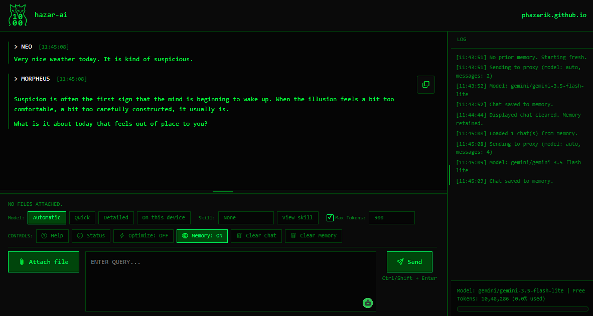
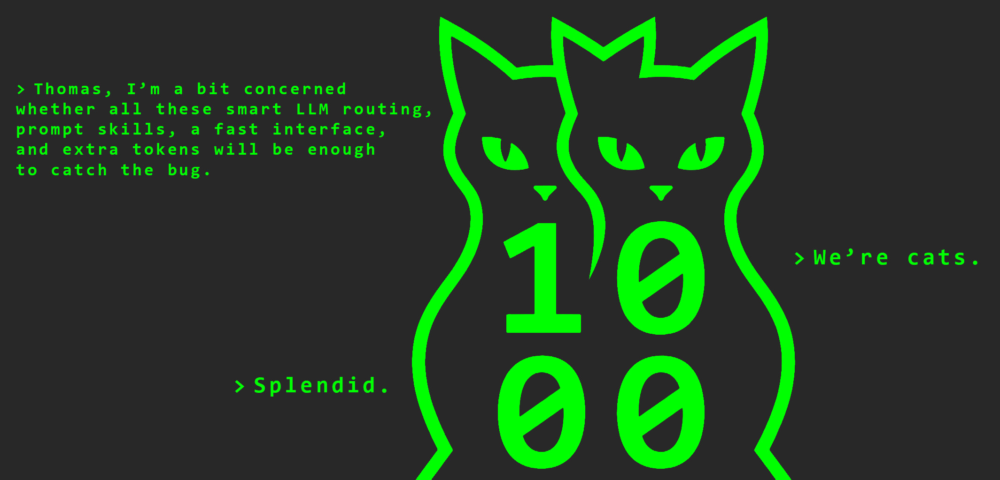
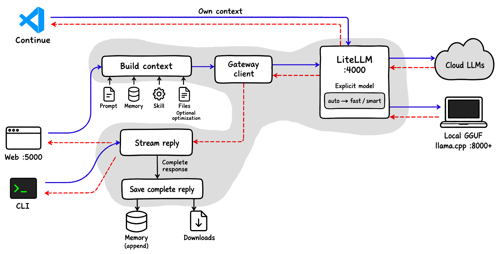

# Hazar-AI

 [](https://github.com/BerriAI/litellm) [](https://pypi.org/project/requests/) [](https://pypi.org/project/rich/) [](https://pypi.org/project/pyfiglet/) [](https://pypi.org/project/PyYAML/) [](https://github.com/abetlen/llama-cpp-python) [](https://huggingface.co/models) [](https://pytorch.org/) [](https://huggingface.co/docs/transformers) [](https://huggingface.co/docs/accelerate) [](https://huggingface.co/docs/safetensors)

[](https://github.com/markedjs/marked) [](https://github.com/highlightjs/highlight.js) [](https://github.com/twbs/icons) [](https://github.com/KaTeX/KaTeX) [](https://github.com/UziTech/marked-katex-extension) [](https://github.com/cure53/DOMPurify) [](https://fonts.google.com/specimen/Fira+Code)

Running cloud models can get expensive, and free tiers have limits. Hazar-AI brings your configured providers and local models into one place, with routing and retries to help keep a chat moving when a route is temporarily unavailable.

This is a local chat setup, with a **terminal** interface, a **browser** interface, and a **VS Code** connection through the Continue extension, for **free access to _hazars_ of cloud and local language models**. It puts model choices, file attachments, optional skills, and saved conversations in one setup. If a configured model is temporarily unavailable, the app can try another route before a reply starts. It does not remove provider limits or make paid models free. Costs and access still depend on the selected providers and accounts.

[](https://github.com/phazarik/hazar-ai#first-time-setup) [](https://github.com/phazarik/hazar-ai#browser-controls) [](https://github.com/phazarik/hazar-ai#cli-examples) [](https://github.com/phazarik/hazar-ai#vs-code-integration-continue)


[](https://github.com/phazarik/hazar-ai#how-it-works) [](https://github.com/phazarik/hazar-ai#local-models-and-offline-use) [](https://github.com/phazarik/hazar-ai#how-it-compares-against-existing-tools) [](https://github.com/phazarik/hazar-ai#when-something-goes-wrong)

## What is included

  

- Automatic model selection, quick and detailed cloud routes, a local-model dropdown, and VS Code integration.
- Streaming cloud and Transformers replies in the terminal and browser. The current GGUF backend sends its reply after generation completes.
- Automatic discovery of supported local models, with one model loaded at a time to conserve RAM and VRAM.
- Shared conversation memory for the CLI and web interface.
- Optional skills stored outside this repository, with full selected skill text included in requests.
- Text-file attachments and optional file optimization.
- Download links for larger generated files, without a download of every chat reply.
- A shared personality file for the CLI, web interface, and generated Continue settings.
- A resizable browser layout with font settings grouped at the top of the stylesheet.

This setup sends prompts and receives replies. It does not automatically run generated code, edit the source files mentioned in a prompt, or provide a built-in web search tool. A configured Tavily key alone does not enable browsing.

## Why this tool?



Let's compare it against different things that are already present. OmniRoute focuses on the gateway, Open WebUI on browser chat, and Aider on editing a codebase. Ponytail supplies coding guidance and can complement a chat or coding tool. This comparison uses the supplied Hazar-AI codebase and the linked upstream documentation, checked on September 18, 2026. It is not a speed, quality, or cost benchmark.

<table>
<thead><tr><th>Tool</th><th>Advantages</th><th>Disadvantages / tradeoffs</th><th>Good fit</th></tr></thead>
<tbody>
<tr><td><strong>This setup</strong></td><td><p>Combines CLI and browser chat, shared conversation history, text attachments, full selected skill text, copy icons, and generated-text downloads. Its scripts also start a shared local inference service for supported GGUF and Transformers models, loading one model at a time. The browser and Python helpers are easy to find and customize.</p></td><td><p>You maintain provider routes and the Python/Linux setup. Startup modes replace matching services, browser chats share history, and the UI has no separate user login. It does not execute generated code or include web search or document retrieval.</p></td><td><p>A personal chat workspace where you want cloud and local models, choose the context yourself, and review output before applying it.</p></td></tr>
<tr><td><strong><a href="https://github.com/diegosouzapw/OmniRoute#readme">OmniRoute</a></strong></td><td><p>Documents a broad provider catalog, quota telemetry, automatic model scoring, configurable routing strategies, and coding-tool integrations.</p></td><td><p>Its extra gateway controls mean more settings to learn. It is a different workflow from Hazar-AI's shared CLI/browser history, selected text skills, and fenced-file downloads. Provider access and quotas still matter.</p></td><td><p>A gateway-focused setup where routing control, provider choice, and quota visibility matter most.</p></td></tr>
<tr><td><strong><a href="https://github.com/open-webui/open-webui#readme">Open WebUI</a></strong></td><td><p>Offers a full browser platform for local and OpenAI-compatible models, with user permissions, document retrieval, web-search integrations, and tools.</p></td><td><p>Its broader platform gives you more features to configure. For a personal workflow built around shared terminal/browser history and a few editable scripts, Hazar-AI may be enough.</p></td><td><p>A richer browser workspace, especially when you need separate users, searchable documents, or connected tools.</p></td></tr>
<tr><td><strong><a href="https://aider.chat/docs/">Aider</a></strong></td><td><p>Provides terminal-based AI pair programming that edits files in a local repository, with Git integration and a repository map for context.</p></td><td><p>It focuses on making code changes in a repository. You need to review those edits. Hazar-AI instead returns chat and generated text for you to copy, download, and apply yourself.</p></td><td><p>Hands-on coding work where you want the assistant to change project files.</p></td></tr>
<tr><td><strong><a href="https://github.com/DietrichGebert/ponytail#readme">Ponytail</a></strong></td><td><p>Encourages reuse and smaller changes. Its upstream integrations include coding review and audit skills, with hooks in supported hosts.</p></td><td><p>It supplies coding guidance rather than a gateway or chat service. Hazar-AI loads the selected skill text and supported local Markdown references; it does not run Ponytail's hooks or plugin commands. Long skills use more model context.</p></td><td><p>Extra guidance for coding replies. It can be used as a text skill in Hazar-AI.</p></td></tr>
</tbody>
</table>

Choose Hazar-AI for this personal chat workflow, OmniRoute for gateway controls, Open WebUI for a fuller browser platform, and Aider for direct repository edits. Ponytail can add coding guidance to a supported host. These choices can overlap: Hazar-AI already uses LiteLLM, and its clients can point at another compatible gateway if you configure the endpoint and aliases. See [alternate gateways](#another-gateway-including-omniroute).

Upstream details: [OmniRoute README](https://github.com/diegosouzapw/OmniRoute#readme), [Open WebUI README](https://github.com/open-webui/open-webui#readme), [Aider documentation](https://aider.chat/docs/), and [Ponytail README](https://github.com/DietrichGebert/ponytail#readme).

## How it works

The repository is structured as follows. Important files are shown.

```text
├── core/
│   ├── config.yaml                    # Edit persistent cloud model routes here
│   ├── ...
│   └──  litellm.env                   # Private API keys are kept here
├── lib/                               # Shared helpers for models, memory, skills, and output
├── models/                            # Place complete GGUF files or Transformers folders here
├── ui/                                # Browser interface, styling, and HTTP backend
├── findModels.py                      # List models offered by configured cloud providers
├── query.py                           # CLI chat
├── requirements.txt                   # Main application and GGUF backend dependencies
├── requirements-local-hf.txt          # Additional dependencies for Transformers models
├── setup.py                           # Prepare folders, credentials, and Continue integration
├── start.sh                           # Start the selected services; supports offline mode
└── kill.sh                            # Stop application services and local model workers
```

The files kept inside `models/` are local downloads, not required repository files. Keep private credentials and large model weights out of Git. Startup rebuilds the generated YAML files; edit `core/config.yaml` for persistent cloud-route changes.



1. **Choose an interface.** The CLI runs through `query.py`. The browser talks to `ui/server.py` on port **5000**. Both use the same chat helpers and conversation store.
2. **Build the context.** The app combines your prompt with its personality rules, saved history when memory is enabled, a selected skill, and any UTF-8 text attachments. Optional optimization compacts valid JSON and avoids repeating identical file blocks; it keeps ordinary source formatting and comments intact.
3. **Send the request.** `lib/proxyClient.py` sends cloud requests to the authenticated LiteLLM gateway on port **4000**. It can retry temporary failures and switch between configured tier aliases before output starts. Local requests go directly to the authenticated local inference service on port **8000**, without switching to cloud models. Once output starts, the client does not automatically replay the request.
4. **Pick a model route.** In the normal configuration, `auto` uses local keyword and length checks to choose `fast` or `smart`. An optional model-based classifier makes a separate provider request. Exact registered model names bypass classification and client tier switching; tier aliases can still use the configured fallback routes. Cloud deployments come from `core/config.yaml`. Supported local models share one inference service on port **8000**; it loads the selected model only when needed. Startup generates corresponding gateway aliases for integrations such as Continue.
5. **Bring the answer back.** Cloud replies return through LiteLLM; local CLI and browser replies return directly through the shared local service. Cloud and Transformers replies can stream incrementally. The current GGUF worker generates the complete reply before sending its text.
6. **Save completed results.** With memory enabled, a successful completed chat is saved to the shared conversation store. Separately, `lib/outputManager.py` captures eligible complete fenced text blocks of at least **1,000 characters** into `output/<chat-ID>/<request-ID>/`. The browser offers download links; the CLI prints the saved folder. Failed or incomplete replies do not create new captured files. The browser's Stop action disconnects its stream, but backend generation can continue and may save a completed result.

**Continue takes a direct path.** The VS Code extension sends its own context to LiteLLM and receives replies directly. It shares the gateway routes and generated personality settings but manages its own context and tools; it does not use Hazar-AI's memory, skill selector, or file capture.

**Offline mode keeps inference local.** `bash start.sh offline` starts the shared local inference service, a local-only gateway, and the browser backend. It requires at least one supported local model. Choose `local` or an exact `local:<relative-path>` identifier; `auto`, `fast`, and `smart` are absent. The browser still uses CDN assets, so local inference and a fully offline web page are separate concerns.

The image predates the shared local inference service. Current default ports are **4000** for LiteLLM, **5000** for the browser backend, and **8000** for all local models. Local models no longer receive separate consecutive ports. The memory shown here is saved conversation context, not a knowledge graph.

## First-time setup

Run the following commands in Linux, WSL, or the development container. The startup scripts need Bash and Linux process tools. On Windows, use a WSL terminal rather than PowerShell. **Python 3.11 or newer is required.** Git is needed to download the project and skills. Local model performance depends on available memory and hardware.

### 1. Download the project

```bash
git clone https://github.com/phazarik/hazar-ai.git
cd hazar-ai
```

### 2. Install dependencies

Using Conda:
```bash
conda create -n llm python=3.11 -y
conda activate llm
python3 -m pip install -r requirements.txt
```
Use one environment, and activate it again in every terminal that runs the Python tools. `requirements.txt` installs the main application dependencies and the llama.cpp backend used for GGUF models.

For supported Hugging Face Transformers model folders, also install:

```bash
python3 -m pip install -r requirements-local-hf.txt
```

The optional requirements add PyTorch, Transformers, Accelerate, and Safetensors. Install them in the same environment as the application. Both local backends use CPU inference by default. GPU acceleration requires a suitable PyTorch installation or `llama.cpp` build, plus the corresponding local-backend settings described below.

If `llama-cpp-python` needs a source build, install compiler tools first. On Ubuntu or Debian:
```bash
sudo apt update
sudo apt install build-essential cmake
```
GPU support needs an appropriate llama.cpp build; the default installation does not guarantee GPU acceleration.

### 3. Create the key file

Generate API keys to access the cloud-based models.:
- [OpenRouter](https://openrouter.ai/workspaces/default/keys): an API gateway for models from different providers. 
- [Google AI Studio](https://aistudio.google.com/app/api-keys): Gemini API keys.
- [Groq](https://console.groq.com/keys): another hosted inference provider.

Write an environment file `core/litellm.env` and put the API keys there. It should look like the following
```bash
OPENROUTER_API_KEY=sk-or-v1-XXXXXXXXXXXX
GEMINI_API_KEY=AQ.XXXXXXXXXXXX
GROQ_API_KEY=gsk_XXXXXXXXXXXX
LITELLM_MASTER_KEY=""      # Leave as "" on a new setup; setup generates this
```
These keys are read by `core/config.yaml`. Unused keys can stay empty. 

Leave `LITELLM_MASTER_KEY` empty on a new installation. The setup generates a private gateway key and connects the local clients to it. An existing usable key is retained; the old `sk-anything` placeholder is replaced. Keep the private key file out of Git. For an offline installation, provider keys can all stay empty.

### 4. Check the configured models

```bash
python3 findModels.py
python3 findModels.py --search llama
```
The script lists models from providers with configured keys. Model names and availability change, so review `core/config.yaml` before starting cloud requests. Remove deployments for unused providers or update their keys and model names. A listed model is not necessarily free or available to every account.

`findModels.py` lists cloud-provider models; it does not inspect local downloads. To list supported models discovered inside `models/`, run:

```bash
python3 query.py --list-models
```

This scans model metadata without loading model weights. Download instructions and supported formats are covered in [Local models and offline use](#local-models-and-offline-use).

Keep the client aliases `auto`, `fast`, `smart`, and `local`. These are the names used by the CLI and GUI; provider model identifiers belong inside their deployments.

### 5. Run setup

```bash
python3 setup.py
```
Setup checks required files, prepares the environment file, makes scripts executable, creates `models/`, and writes:

- Continue settings to `~/.continue/config.yaml`.
- The Continue gateway secret to `~/.continue/.env`.
- An optional user service to `~/.config/systemd/user/litellm.service`.

Setup does not start the services. It preserves existing provider keys, but **overwrites the generated Continue configuration**. Backup manual Continue changes before rerunning it.
> **Gateway key:** Setup generates `LITELLM_MASTER_KEY` if no valid key exists and saves it in `core/litellm.env`. Later runs retain the saved valid key. For Windows-side Continue, copy this key into the active Continue configuration's `apiKey` field once. Setup running in WSL writes only the Linux-side Continue files.

### 6. Start and try a message

```bash
bash start.sh all
```
Open **http://localhost:5000** in a browser. In another terminal, activate the same Python environment and try:
```bash
python3 query.py --query "Reply with a short greeting." --no-memory
```
The startup opens a gateway log view. **Ctrl+C closes that view; background services keep running.** Stop them with:
```bash
bash kill.sh
```

## Startup options

```bash
bash start.sh
bash start.sh all      # Gateway + browser backend + shared local inference service
bash start.sh fresh    # Clear shared memory, then start the complete setup
bash start.sh offline  # Local service + local-only gateway + browser; requires a model
bash start.sh proxy    # LiteLLM gateway only; no browser or local inference service
bash start.sh local    # Local inference service + generated routes; no gateway/UI
bash start.sh ui       # Browser backend only; needs an independently running inference service
```
**Every startup mode first stops matching existing services.** Running `start.sh proxy` followed by `start.sh ui` does not combine them: the second command stops the first service. Use `all` for the complete setup. Shutdown patterns can also match another Hazar-AI installation in the same Linux environment.

| Service | Default address |
| --- | --- |
| LiteLLM gateway | `http://localhost:4000` |
| Browser interface | `http://localhost:5000` |
| Shared local inference service | `http://127.0.0.1:8000` |

The web backend binds on all interfaces and has no separate user login. Keep it in a trusted local environment; it is not a public multi-user service.

## Install and manage skills

A skill is a text file with extra instructions for a task. Hazar-AI reads only this layout:
```text
~/.claude/skills/<skill-name>/SKILL.md
```
Keep this exact layout for every skill; a nested upstream skill needs a root file or link.
Use the home directory of the account running the backend. Under WSL, this normally means the Linux home directory, not the Windows home directory. Keep all skills here. Following are some examples:

- **Prompt master:** a skill for turning a task, context, and constraints into a clearer prompt for another AI tool. See its [upstream README](https://github.com/nidhinjs/prompt-master). Hazar-AI uses the selected text, not the upstream host integration.
	```bash
	mkdir -p ~/.claude/skills
	git clone https://github.com/nidhinjs/prompt-master.git ~/.claude/skills/prompt-master
	```
	
- **Ponytail:** coding guidance that favors reuse and small, complete solutions while preserving validation, error handling, security, and accessibility. See its [upstream README](https://github.com/DietrichGebert/ponytail). Its main skill is nested, so add a link after cloning: 
	```bash
	git clone https://github.com/DietrichGebert/ponytail.git ~/.claude/skills/ponytail
	ln -s skills/ponytail/SKILL.md ~/.claude/skills/ponytail/SKILL.md
	```
- **Create your own:** Here is an example. `ponytail-lite` is a local skill name, not a separate upstream repository. An existing folder with that name can stay in place. To create a short version from scratch:
	```bash
	mkdir -p ~/.claude/skills/ponytail-lite
	cat > ~/.claude/skills/ponytail-lite/SKILL.md <<'EOF'
	# Small, complete changes
	Read the relevant code before choosing a solution.
	Make the smallest complete change that satisfies the request.
	Reuse existing helpers and standard-library features first.
	Avoid unnecessary dependencies, abstractions, and unrelated edits.
	Keep code readable; do not compress it into long one-line expressions.
	Preserve comments, validation, error handling, security, and accessibility.
	Follow the active task when it asks for more detail or a fuller solution.
	Explain the result briefly and report only checks actually performed.
	EOF
	```

### Check, update, or remove a skill
```bash
python3 query.py --list-skills
python3 query.py --skill-inspect prompt-master
python3 query.py --skill-inspect ponytail
```
Refresh the browser after adding or removing a skill. Changes to a selected skill's text are read on the next request. To stop using a skill, select **None**; to remove it from the list, move its folder outside `~/.claude/skills/`.

The current CLI and web requests include the **full selected skill text**, with supported local Markdown references expanded from the skill's `references/` folder. `buildSkillMessages()` in `lib/skillLoader.py` calls `loadSkill(name, fullText=True)`, so the old 3,000-character cap is bypassed. Full inspection is also unlimited.

To bring back the cap, change that call to `loadSkill(name)` and set `SKILL_CHAR_LIMIT` to the value you want. Restart the web backend after changing Python code; the next CLI process reads the new value. Full skills use more model context and may increase provider usage. The app does not currently trim the full request to fit the chosen model, so very long skills, attachments, or chats can exceed its context limit.

Hazar-AI reads skill text; it does not install or execute upstream hooks, scripts, or plugin commands. A skill may refer to host features or files that this loader does not provide.

## Browser controls

Open **http://localhost:5000** after starting the full setup.

The toolbar has two rows. Model controls sit on the left of the first row, with the skill selector on the right. The second row places request and memory controls on the left, with Help and Status on the right. Selecting Local reveals a wider model dropdown styled like the skill selector, alongside a compact refresh icon.

<table>
<thead>
<tr><th>Control</th><th>What happens</th></tr>
</thead>
<tbody>
<tr><td nowrap>Automatic</td><td><p>The app chooses a quick or detailed route for the request.</p></td></tr>
<tr><td nowrap>Quick</td><td><p>Requests the <code>fast</code> route for everyday questions.</p></td></tr>
<tr><td nowrap>Detailed</td><td><p>Requests the <code>smart</code> route for harder tasks.</p></td></tr>
<tr><td nowrap>Local</td><td><p>Shows a dropdown of supported models discovered inside <code>models/</code>. Choose the model for the next request. The shared local inference service must be running.</p></td></tr>
<tr><td nowrap>Refresh models icon</td><td><p>Rescans the local model directory and updates the dropdown without loading model weights.</p></td></tr>
<tr><td nowrap>Skill</td><td><p>Adds the selected skill's instructions to the next request. <strong>None</strong> adds no skill.</p></td></tr>
<tr><td nowrap>View skill</td><td><p>Opens the selected skill's full expanded text without sending a chat message.</p></td></tr>
<tr><td nowrap>Max Tokens</td><td><p>Sets the maximum reply length. Unchecking it omits the client's explicit limit. Cloud services retain their own defaults; the local backend applies a bounded default that must fit the model's remaining context.</p></td></tr>
<tr><td nowrap>Help</td><td><p>Opens the control guide.</p></td></tr>
<tr><td nowrap>Status</td><td><p>Prints saved-memory information in the log panel.</p></td></tr>
<tr><td nowrap>Optimize</td><td><p>Toggles file-context optimization for the next request.</p></td></tr>
<tr><td nowrap>Memory</td><td><p>Toggles whether the next request uses and saves conversation memory. Turning it off does not delete existing memory.</p></td></tr>
<tr><td nowrap>Clear Chat</td><td><p>Hides displayed messages without deleting memory. Saved messages may return after a refresh.</p></td></tr>
<tr><td nowrap>Clear Memory</td><td><p>Asks for confirmation, deletes shared conversation memory, and clears the displayed chat.</p></td></tr>
<tr><td nowrap>Attach file</td><td><p>Opens the file picker. Files can also be dropped onto the page and removed before sending.</p></td></tr>
<tr><td nowrap>Send</td><td><p>Sends the prompt and queued attachments.</p></td></tr>
<tr><td nowrap>Stop</td><td><p>Disconnects the browser's active reply stream, restores the prompt and attachments, and leaves partial output visible. Backend generation may continue and save a completed result.</p></td></tr>
<tr><td nowrap>Copy icon</td><td><p>The icon beside Morpheus's label copies the reply as Markdown. Each code or text block has its own top-right icon that copies only that block's content, without the fence markers.</p></td></tr>
</tbody>
</table>

Press **Enter** or **Shift+Enter** for a new line. Press **Ctrl+Enter** to send. Drag the divider above the input to change its height. Drag the diagnostics divider to change the side-panel width on desktop or its height on mobile.

Copy icons work for streamed replies and restored history, including small blocks that do not qualify for downloads. A checkmark shows a successful copy.

The usage display uses backend token counts when available and otherwise reports an estimate. For local models, it measures prompt plus reply tokens against the active context window. Local inference has no provider token quota, but context length and available RAM or VRAM remain finite. For cloud models, the display uses the reported input limit; it is not an account quota or remaining balance.

### Generated-file downloads

Ordinary replies stay in the chat. The app does not automatically save the whole reply as `response.md` or offer a full-response download. Complete fenced code or text blocks become downloadable files only when each block contains at least **1,000 characters**, excluding surrounding whitespace.
> Change `MIN_FILE_CHARACTERS = 1000` in `lib/outputManager.py` to adjust the download-link cutoff

Copy icons are separate from file capture and have no minimum block size. The current capture handles text blocks, not binary files or links to files on a remote model service. Failed or incomplete replies do not create new captured files. Disconnecting the browser stream does not guarantee that backend generation or file capture stops.

Named blocks keep their safe relative filenames; unnamed blocks get names such as `snippet-1.py`. For example, ask:
```text
Write a complete Python module for the task. Return it as a fenced block
with filename="report.py", preserving the comments.
```
Eligible files are stored under:
```text
output/<chat-ID>/<request-ID>/
```
The browser shows a link for each saved file. Downloading requires clicking the link; files are not downloaded automatically. The CLI prints the output folder when files are saved. Replies without eligible files create no new output folder.

## CLI examples

### Ask a question or choose a model

```bash
python3 query.py --query "Explain this Python error."
python3 query.py --model auto --query "Help design a small task tracker."
python3 query.py --model fast --query "Show a Python dictionary example."
python3 query.py --model smart --query "Review this design for edge cases."
```
`auto` is the default. Its first choice uses local keyword and length checks, without an extra provider classification request. Configured alternatives may be tried if a route fails before output begins.

An exact model alias registered in the gateway can also be used with `--model`. Such a name bypasses automatic classification and client tier switching.

### List or choose a local model

```bash
python3 query.py --list-models
python3 query.py --model local --query "Explain a Python list comprehension." --no-memory
python3 query.py --model "local:qwen2.5-1.5b-instruct-q4_k_m.gguf" --query "Hello." --no-memory
```

`local` selects the first discovered model in the sorted list. To select a specific model, copy its exact identifier from `--list-models`. Identifiers preserve the path relative to `models/`, including the `.gguf` extension. Transformers models use their directory path instead.

### Attach files and optimize their context

```bash
python3 query.py --query "Find bugs in this file." --file app.py
python3 query.py --query "Check how these files work together." --file app.py config.json
python3 query.py --query "Review the configuration." --file config.json --optimize-tokens
```
Attachments are read as UTF-8 text. Optimization shortens valid JSON without changing its values and avoids repeating identical file blocks already present in the request. It does not strip comments or indentation from ordinary source files. Actual savings depend on the content and model.

### Use a skill

```bash
python3 query.py --skill prompt-master --query "Write a prompt for an AI coding assistant to review a Python API."
python3 query.py --skill ponytail --query "Simplify this module without changing its behavior." --file app.py
python3 query.py --skill ponytail-lite --query "Fix the bug with a small, readable change." --file app.py
```

Leaving out `--skill` adds no skill instructions.

### Adjust reply length or skip memory

```bash
python3 query.py --query "Give a short explanation." --max-tokens 300
python3 query.py --query "Write the complete module." --max-tokens 3000
python3 query.py --query "One-off question: explain a generator." --no-memory
```
The default reply limit is **900 tokens**. Tokens are pieces of text, not an exact word count. A larger limit allows more output but cannot guarantee a complete reply. A reply cut short by the limit is treated as incomplete and is not saved to memory or captured as files.

`--no-memory` skips both reading and saving conversation memory for that request. Existing memory is retained. The CLI has no dedicated switch to remove the reply-length limit.

### Combine different options

```bash
python3 query.py \
    --model smart \
    --query "Find the bug and return a complete corrected file." \
    --file app.py config.json \
    --skill ponytail-lite \
    --optimize-tokens \
    --max-tokens 3000 \
    --no-memory
```

### Inspect or clear saved memory

```bash
python3 query.py --memory-status
python3 query.py --clear-memory
python3 query.py --help
```
The status command shows saved chat count, summary length, and cached files. Clearing memory deletes the CLI/web conversation context, not generated files or installed skills. These utility commands do not need a completion request.

## Local models and offline use

Hazar-AI scans `models/` recursively without loading model weights. Supported downloads appear in the browser's Local dropdown and in `python3 query.py --list-models`.

### Supported formats

- **GGUF:** complete `.gguf` files, using llama.cpp. Split GGUF models require every part of the split.
- **Transformers:** complete causal-language-model directories containing `config.json`, tokenizer files, and supported Safetensors or `pytorch_model*.bin` weights. Sharded weights require their index file and every referenced shard.

A standalone `.safetensors` or `.bin` file is not treated as a complete Transformers model. The current loader does not support encoder-decoder models, adapter-only downloads, or Hugging Face checkpoints with a `quantization_config`, including common FP8, AWQ, GPTQ, and bitsandbytes checkpoints. Architectures must be supported by the installed Transformers version without custom remote code.

### Downloading models from Hugging Face

Hugging Face provides a Hub where publishers share model repositories containing weights, configuration, tokenizer files, and model documentation. Browse its [model catalog](https://huggingface.co/models) and read the model card before downloading. Check the license, intended use, format, and hardware requirements. See the [Hub model documentation](https://huggingface.co/docs/hub/models).

For GGUF, open the repository's **Files and versions** tab and download one suitable complete GGUF variant into `models/`. Different quantization variants are alternative downloads; you normally need only the variant you intend to run. For a split variant, download every part.

For Transformers, download the complete model repository into its own directory under `models/`. Preserve the original filenames and directory layout. Downloading just one weight shard is insufficient.

For example, after installing `requirements-local-hf.txt`, download the [DeepSeek-R1-Distill-Qwen-1.5B repository](https://huggingface.co/deepseek-ai/DeepSeek-R1-Distill-Qwen-1.5B/tree/main) from the project directory:

```bash
python3 - <<'PY'
from huggingface_hub import snapshot_download

snapshot_download(
    repo_id="deepseek-ai/DeepSeek-R1-Distill-Qwen-1.5B",
    local_dir="models/deepseek-r1-distill-qwen-1.5b",
)
PY
```

`snapshot_download` downloads a repository while preserving its structure in the destination directory. Some repositories require authentication and acceptance of access conditions. See the [official download guide](https://huggingface.co/docs/huggingface_hub/guides/download).

> **Warning — download size and hardware requirements:** Model downloads can range from hundreds of megabytes to hundreds of gigabytes. Check individual file sizes and the total download size under **Files and versions** before downloading. Ensure you have enough disk space, bandwidth, and RAM or VRAM to run the model; download size alone does not indicate its runtime memory requirements. Start with a small model or a suitable quantized GGUF variant. For sharded models, every required shard must be downloaded; a single shard cannot run independently.

### Select and run a model

A typical layout is:

```text
models/
├── qwen2.5-1.5b-instruct-q4_k_m.gguf
└── deepseek-r1-distill-qwen-1.5b/
    ├── config.json
    ├── model.safetensors
    ├── tokenizer.json
    └── tokenizer_config.json
```

Start the complete setup and inspect the available identifiers:

```bash
bash start.sh all
python3 query.py --list-models
```

Choose **Local** in the browser and select a model from the dropdown. Use the refresh icon after adding or removing downloads.

For the CLI:

```bash
python3 query.py \
    --model "local:qwen2.5-1.5b-instruct-q4_k_m.gguf" \
    --query "Hello." \
    --no-memory

python3 query.py \
    --model "local:deepseek-r1-distill-qwen-1.5b" \
    --query "Explain a Python generator." \
    --no-memory
```

The plain `local` alias selects the first discovered model in sorted order. Nested downloads retain their relative directory path in the identifier.

### Memory usage and context limits

All local models share one service on port **8000**. The selected model loads on its first request and stays available for reuse. Switching models unloads the previous worker before loading the next one. By default, an idle model unloads after five minutes.

GGUF uses memory mapping; the Transformers loader uses low-memory loading. These settings reduce avoidable overhead, but model weights and inference still require sufficient RAM or VRAM. The local service processes one inference request at a time.

Optional settings can be placed in `core/litellm.env`; restart after changing them:

```bash
HAZAR_LOCAL_CONTEXT="4096"      # Requested context; capped by model metadata
HAZAR_LOCAL_IDLE_SECONDS="300"  # Idle unload delay; 0 keeps the model loaded
HAZAR_LOCAL_TIMEOUT="600"       # Maximum worker silence before timeout
HAZAR_GPU_LAYERS="0"            # GGUF GPU offload; requires a compatible build
HAZAR_LOCAL_DEVICE="cpu"        # Transformers device; GPU needs suitable PyTorch
```

Local models have no provider token quota, but their context windows are finite. Prompt, history, skills, attachments, and generated output must fit the active context. Oversized local requests are rejected rather than silently discarding history.

Local chats skip automatic cloud-based memory summarization. Long histories can therefore exceed the model's context. Use `--no-memory`, turn Memory off in the browser, or clear memory when starting a separate task.

### Offline operation

For local-only inference:

```bash
bash start.sh offline
python3 query.py --model local --query "Hello." --no-memory
```

Offline startup requires at least one supported model. Its generated gateway configuration contains only local routes; `auto`, `fast`, and `smart` are not registered. Cloud-provider keys can remain empty.

The browser still loads libraries, fonts, and icons from external sites. Fully disconnected browser use requires those assets to be cached or hosted locally. The CLI can operate offline once dependencies and model files are installed.

The browser and CLI rescan local downloads without restarting inference services. Gateway aliases used by Continue are generated during startup, so restart the appropriate startup mode after adding or removing models.

Generated configurations are rebuilt automatically. Edit `core/config.yaml` for persistent cloud changes rather than editing generated YAML files.

## VS Code integration: Continue

1. Install the [Continue extension](https://marketplace.visualstudio.com/items?itemName=Continue.continue) in VS Code.
2. Go to its setting and open **Configs**.
3. Edit the Main Config (or add any other config) by clicking the gear icon, which opens the `config.yaml`. Configure it to connect to the running proxy:
	```yaml
	name: hazar-ai
	version: 1.0.0
	schema: v1

	models:
	  - name: hazar-router
	    provider: openai
	    model: auto  # Use fast, smart, local, or an exact registered model alias.
	    apiBase: http://localhost:4000/v1
	    apiKey: "PASTE_THE_GENERATED_LITELLM_MASTER_KEY_HERE"
	    roles:
	      - chat
	      - edit
	```

**Gateway key:** The first run of `python3 setup.py` generates `LITELLM_MASTER_KEY` when no valid key exists and saves it in `core/litellm.env`. Copy the complete value into `apiKey` above. Cloud-provider API keys are not used for this connection.

Normal application restarts and later setup runs retain the saved valid key. Continue requires a key update only if that key changes. However, setup overwrites its generated Continue YAML, so back up manual configuration changes before rerunning it.

Save the configuration, reload the VS Code window, and select **hazar-router** in Continue. For local-only operation, change `model: auto` to `model: local`.

> **WSL:** VS Code can remain installed on Windows. Opening the project through the WSL extension and installing Continue in that WSL window uses the Linux configuration. Continue running in a regular Windows window uses the Windows configuration instead. `localhost:4000` normally reaches the proxy running in WSL. Running setup in WSL does not update Windows-side Continue files.

The configuration normally resides at `~/.continue/config.yaml` on Linux/WSL or `%USERPROFILE%\.continue\config.yaml` on Windows. Keep configurations containing the gateway key private and outside Git.

Continue uses the proxy's model routes but manages its own context, separate from Hazar-AI's browser and CLI memory.


## Customize the setup

### Personality

Edit `SYSTEM_PROMPT` in `lib/systemPrompt.py`. The current prompt uses Morpheus/Neo customization as follows. It relies on supplied history rather than claiming perfect memory.
```python
SYSTEM_PROMPT = (
    "You are Morpheus, a calm, thoughtful guide. The user is Neo. "
    "Use direct reference from the Matrix when hinted by the user. "
    "Normally keep a subtle Matrix-inspired tone without forced references. "
    "Do not call the user Neo in every reply unless asked. "
    "Only the first reply is allowed to directly refer to the user as Neo. "
    "Give clear, practical answers and complete the active task. "
    "Use the conversation history provided in this request. "
    "Older messages may be summarized or missing; do not invent memories. "
    "Format responses cleanly in Markdown. "
    "Do not start with a large heading. "
    "Never use emojis."
)
```
The GUI labels **NEO** and **MORPHEUS** are set separately in `createMsgBox(role)` inside `ui/script.js`. To change their displayed names, add this before the `label.innerHTML` assignment:
```javascript
    // Display names are separate from the internal roles used for styling.
    const displayName = role === "neo" ? "USER" : "ASSISTANT";
```
In the following `label.innerHTML` assignment, replace `${role.toUpperCase()}` with `${displayName}`. Change `"USER"` and `"ASSISTANT"` to the preferred names. Keep the internal `neo` and `morpheus` roles unchanged because CSS and other interface logic depend on them. Update the names in `SYSTEM_PROMPT` separately to change the model's personality.

Restart/refresh the web backend after a change. The next CLI invocation reads the system prompt automatically. Rerun setup to copy the updated personality into Continue, preserving any manual Continue configuration changes first.

### Font and theme

Edit the `:root` section at the top of `ui/style.css`. Font family, base size, relative sizes, weights, line spacing, and theme colors live there. Consolas is preferred when installed, with monospace fallbacks. The base size is `13px`. Change `--font-weight-emphasis` to `700` for bold labels and headings, or `400` for regular weight. Refresh with **Ctrl+F5** after changing frontend files.

### Memory

The CLI and web interface share one memory store for the installation. Separate browser tabs do not have isolated conversation histories, even though generated files use chat IDs.

`memory/graph.json` stores messages, `memory/summary.txt` stores older context, and `memory/files.json` stores attachment metadata. This is conversation storage, not a knowledge graph.

For cloud chats, after more than 20 chat pairs, the app attempts to summarize older messages using the `fast` route and keep the latest 10 pairs intact. Summarization is a separate request and can use provider quota. If it fails or returns unusable content, full history stays in place. Summaries can lose detail.

Local chats disable automatic summarization to avoid a cloud request. Their retained history can outgrow the local context window. History is still shared: selecting a cloud model later includes enabled saved context in that cloud request.

### Automatic selection

Local classification is the default. To enable a separate model request for classification, add this to `core/litellm.env` and restart:
```bash
HAZAR_LLM_CLASSIFIER="1"
```
This uses provider quota and falls back to local checks if classification fails. Classifier deployments are configured in `core/routerHook.py`.

### Another gateway, including OmniRoute

The clients can use another compatible chat-completions endpoint. Set these server-side values in `core/litellm.env`:

```bash
HAZAR_PROXY_URL="http://127.0.0.1:PORT/v1/chat/completions"
HAZAR_PROXY_KEY="replace-with-gateway-key"
```
Replace `PORT`, the path, and the key with the gateway's actual settings. Configure compatible model aliases in that gateway too. Restart the web backend; new CLI processes read the new values. Rerun setup if Continue should use the same endpoint. These settings redirect cloud and tier requests; local model requests still use the shared local inference endpoint. They do not install or configure OmniRoute. `start.sh all` still starts the bundled LiteLLM service. Provider credentials stay on the server, outside browser JavaScript.

### Optional systemd service

Setup writes the gateway unit but does not enable it. The current generated unit needs one path correction for the routing callback: in `~/.config/systemd/user/litellm.service`, change its `PYTHONPATH` value to include both `<project-path>/core` and `<project-path>`, separated by a colon. Use the actual absolute project path, as `start.sh` does. Otherwise, the gateway may fail to import `routerHook`. In a Linux environment with user systemd support, after that correction:
```bash
systemctl --user daemon-reload
systemctl --user enable --now litellm.service
systemctl --user status litellm.service
```
The generated service starts only the gateway with `core/config.yaml`. It does not start the UI or shared local inference service. Avoid running it alongside startup-script management of the same gateway. Stop and disable it before returning to the regular startup flow:
```bash
systemctl --user disable --now litellm.service
```

## Cleanup

Use the `cleanup.py` script. It removes logs, editor backups, Python caches, and the generated `codebase.md` file. Memory, output files, models, and external skills remain.
```bash
python3 cleanup.py
python3 cleanup.py --all
```
**`--all` also deletes `memory/` and `output/`.** Save any generated files needed later, and stop services before cleanup. For memory alone, use `python3 query.py --clear-memory`.

## When something goes wrong

### The browser says "localhost refused to connect"

First check the UI log:
```bash
tail -n 80 core/ui.log
```
A “started” line only means the process was launched; it can still exit immediately. After stopping services, run the backend directly to see its error:
```bash
bash kill.sh
python3 ui/server.py
```
This tests UI startup; cloud replies need a running gateway, while local replies need the shared local inference service. Keep the same Python environment active so the backend and gateway use the installed dependencies. Close the foreground server, then use `bash start.sh all` once the problem is fixed. For a remote container or Codespace, open its forwarded port `5000` rather than the host's unrelated localhost address.

### A model returns 404, 401, or repeated errors

Check `core/litellm.log`, verify the provider key, and run `python3 findModels.py`. Update model identifiers and remove unavailable deployments from `core/config.yaml`, then restart. Retries can help temporary failures; they cannot fix invalid credentials or permanently unavailable models. If a reply has already started, the app does not silently replay it on another model. Partial output stays visible, and the prompt is restored for another attempt.

### A local model is missing or fails to load

Run `python3 query.py --list-models`. For GGUF, check that the download is complete and every split part is present. For Transformers, check the configuration, tokenizer, weights, and any shard index. A lone Safetensors shard is not a complete model.

Install `requirements-local-hf.txt` when using Transformers models, then check `core/local.log` for loading errors. Unsupported architectures, quantization formats, or insufficient RAM/VRAM can prevent loading.

For context-limit errors, reduce attachments, skill text, history, or the requested reply length. A local HTTP 409 response means another inference request is active; wait for it to finish.

### No skill appears

Check the exact path and capitalization: `~/.claude/skills/<name>/SKILL.md`. Folder names must use letters, numbers, underscores, or hyphens. Run `--list-skills`, check which Linux account runs the backend, and refresh the browser. For Ponytail, check the root link to the nested skill file.

### No download link appears

A greeting, a small block, an unfinished fence, an unsafe filename, or a failed reply will not produce a download. A block must meet `MIN_FILE_CHARACTERS`; a long prose response alone does not count as a generated file.

### The shortcut or skill help text looks outdated

The current `ui/index.html` still says `Ctrl/Shift + Enter` and mentions a 3,000-character skill cap. Those labels are outdated: the JavaScript sends with **Ctrl+Enter**, and the backend includes full selected skills. To match this README, update those two labels and refresh the page.

### Fonts or styles look unchanged

Use **Ctrl+F5** (refresh) to bypass the browser cache. Consolas must be installed on the machine displaying the page; otherwise the next available font is used.

## Start small

Begin with one working cloud provider or one local model, a short greeting, and no skill. Add attachments, memory, and task-specific skills once that basic path works. Keep prompts clear, save useful generated files, and check important code before running it. Morpheus can help with the work; the final decisions still belong to the person building it.
